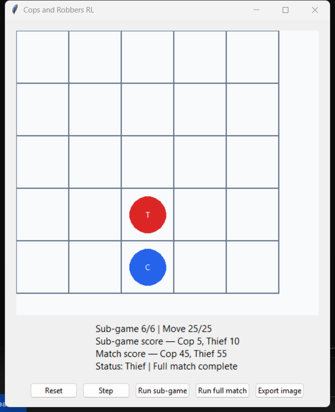

# GUI screenshot

The native Tkinter GUI is implemented and captured from the Windows target machine after a deterministic six-game demo:

Reproduce it with `powershell -File scripts/capture_gui.ps1`. The GUI's **Export image** button also writes a color PostScript canvas snapshot to `results/screenshots/` without adding a third-party imaging dependency.
