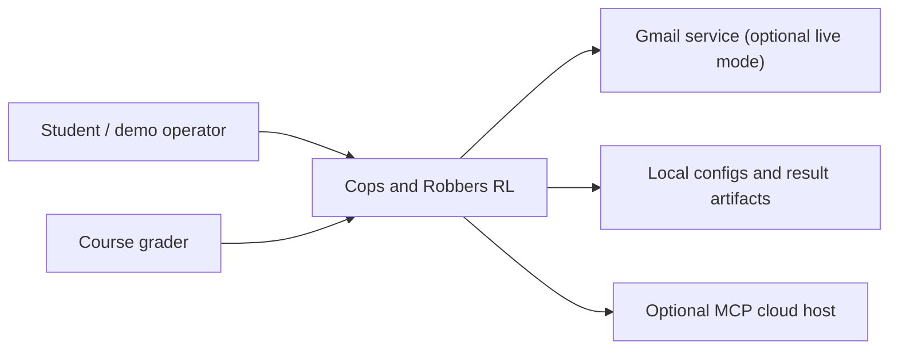
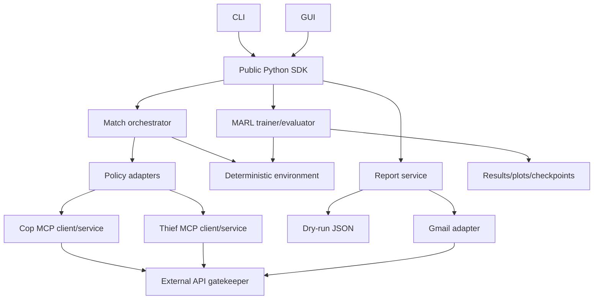
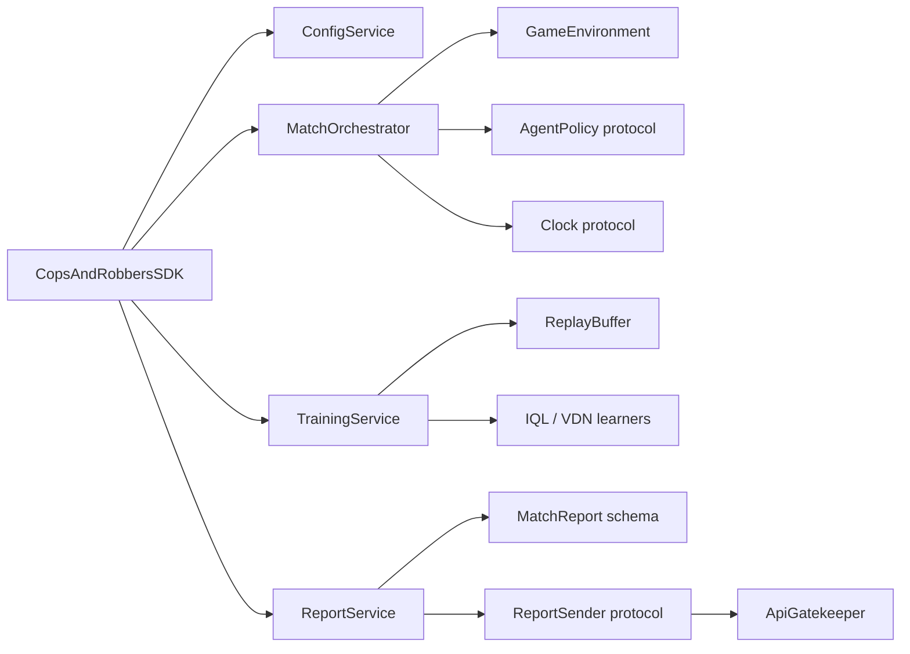
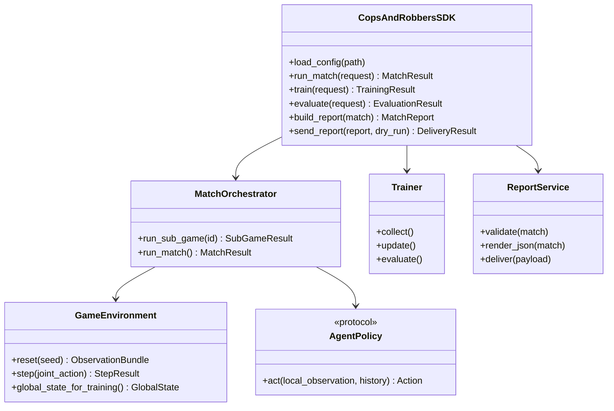
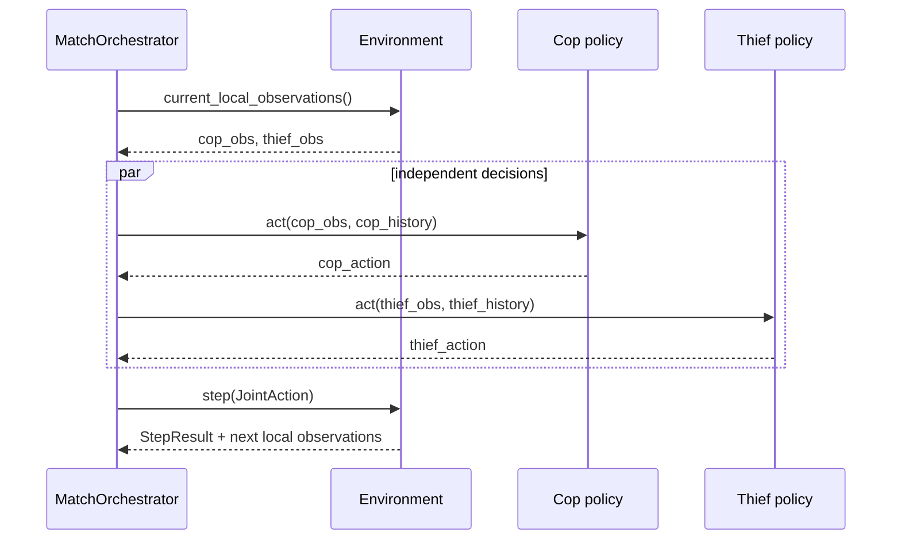
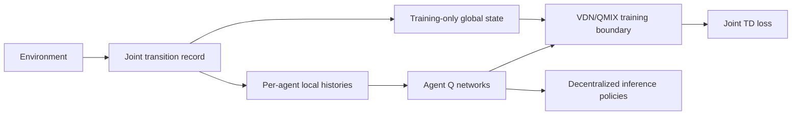
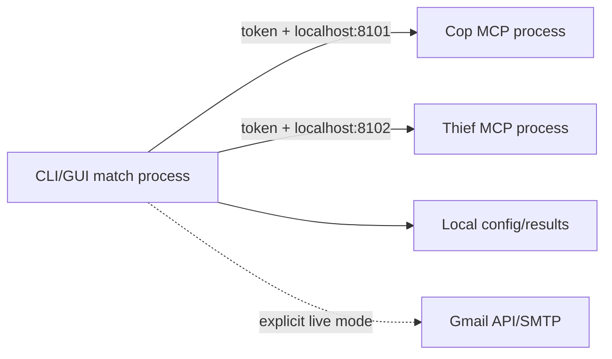

# Architecture and Implementation Plan

## 1. Architectural drivers

The design prioritizes deterministic rules, execution-time information isolation, SDK-only business access, reproducible experiments, local-first operation, and replaceable infrastructure. The engine must be useful without GUI, MCP, Gmail, cloud, or learning dependencies.

## 2. C4-style views

### Level 1 - system context



### Level 2 - containers



### Level 3 - components and dependency direction



### Level 4 - core class sketch



## 3. Layer responsibilities

| Layer | Owns | Must not own |
|---|---|---|
| SDK | Public requests/results, validation entry points, workflow delegation | UI widgets, HTTP transport details, duplicated rules |
| Domain/environment | Immutable state, legal actions, transition order, capture, scoring | GUI, network, Gmail, training frameworks |
| Application services | Match orchestration, training/evaluation workflow, reporting workflow | Hidden globals, transport-specific credentials |
| Policy/MARL | Agent decisions, replay, learning updates, metrics | Direct GUI/file/email side effects |
| Infrastructure | YAML/files, MCP transport, Gmail, clock, logging | Recomputing game outcomes |
| Presentation | CLI and GUI mapping to SDK DTOs | Business rules or global training state |

## 4. OOP design

- `GameConfig`, `TrainingConfig`, `McpConfig`, and `GmailConfig` are validated immutable value objects.
- `GameState`, `LocalObservation`, `GlobalTrainingState`, `Action`, `StepResult`, `SubGameResult`, and `MatchResult` are separate typed models.
- `GameEnvironment` has one responsibility: deterministic state transition and observation generation.
- `MatchOrchestrator` coordinates injected policies, clock, and environment factory; it retries technical failures without scoring them.
- `AgentPolicy` is implemented by random, heuristic, local learned, and remote MCP adapters.
- `Learner` separates training updates from inference policies. A learned policy is exported in inference-only form.
- `ReportService` consumes `MatchResult`; it never recalculates winners or scores.
- `ApiGatekeeper` is the sole route for external calls and owns timeout, rate limit, bounded retry, queueing, and redacted telemetry.
- Composition is preferred over inheritance. A small abstract base is allowed only where shared invariants exist; mixins must have one independently testable concern.

## 5. Data flow and trust boundaries

### Match step



The orchestrator never passes `GlobalTrainingState` to `AgentPolicy.act`. Rendering may receive a read-only snapshot, but this is not a policy input.

### CTDE training



### Reporting

`MatchResult -> schema validation -> canonical JSON -> dry-run file OR explicit live sender`. Finalization is rejected unless there are exactly six valid sub-games. Timestamps are injected in Asia/Jerusalem and serialized as ISO 8601 with offsets.

## 6. Public SDK and contracts

The planned facade is the sole stable import surface:

```python
sdk = CopsAndRobbersSDK.from_config("config/default_game.yaml")
match: MatchResult = sdk.run_match(MatchRequest(...))
report: MatchReport = sdk.build_report(match)
delivery: DeliveryResult = sdk.send_report(report, dry_run=True)
```

DTOs shall be serializable and versioned. Exceptions shall be typed (`ConfigError`, `IllegalActionError`, `PolicyTimeoutError`, `IncompleteMatchError`, `DeliveryError`) and translated only at presentation boundaries.

## 7. Package plan

```text
src/cops_and_robbers_rl/
  sdk/{facade,requests,results}.py
  environment/{actions,state,rules,observations,scoring,engine}.py
  agents/{protocol,random,heuristic_cop,heuristic_thief,learned,remote}.py
  marl/{replay,iql,vdn,networks,trainer,metrics}.py
  mcp/{cop_server,thief_server,client,auth,schemas}.py
  reporting/{schemas,service,dry_run,gmail}.py
  gui/{app,renderer,view_model}.py
  shared/{config,gatekeeper,logging,paths,version}.py
```

Modules will be split before exceeding approximately 150 logical code lines. Imports are package-relative or absolute package imports; file paths derive from configured/project roots.

## 8. Deployment views

### Required local mode



### Optional cloud mode

The same service contracts may be containerized behind TLS and a secret manager. Public deployment requires authentication, health/readiness probes, origin/network restrictions, request limits, audit logs, and revocation. Cloud is not an acceptance dependency for the local core.

## 9. Architectural Decision Records

### ADR-001: SDK facade is the only business entry point - Accepted

**Decision:** CLI, GUI, MCP integration, and scripts call the SDK. **Why:** one validation and orchestration path prevents divergent rules. **Alternative rejected:** direct imports into domain internals, which are convenient initially but create coupling and duplicated workflows.

### ADR-002: POSG is the primary game model; Dec-POMDP notation is retained - Accepted

**Decision:** describe the adversarial game as a POSG with separate rewards. Use the course-required Dec-POMDP tuple to map shared mechanics and explain the cooperative approximation behind value factorization. **Trade-off:** theory is more nuanced, but avoids falsely calling adversaries fully cooperative.

### ADR-003: simultaneous intent with deterministic resolution - Proposed pending implementation approval

Collect both actions from the same pre-step observations, validate them, apply barrier placement, resolve moves, then detect capture. A direct position swap counts as capture to avoid agents passing through each other. Illegal movement becomes `STAY`. This must be frozen by tests before engine code.

### ADR-004: IQL baseline, VDN first CTDE candidate - Accepted

IQL exposes non-stationarity. VDN has a smaller implementation surface than QMIX and can validate the training/execution boundary. Because the game is competitive, the exact payoff/mixer formulation must be declared and results treated as empirical rather than guaranteed. QMIX is optional.

### ADR-005: local-first MCP with two processes - Accepted

Separate services at ports 8101/8102 satisfy independence and simplify failure isolation. Cloud uses identical contracts later. In-process mocks are test doubles, not compliance evidence.

### ADR-006: mandatory dry-run; live Gmail is opt-in - Accepted

Canonical JSON generation is always available. Sending requires explicit `dry_run: false` and environment credentials. This makes submission testable without weakening credential safety.

### ADR-007: YAML plus environment-secret indirection - Accepted

YAML carries non-secret reproducible configuration. Secret fields contain environment-variable names, never secret values. JSON was considered; YAML is clearer for research configs, with strict schema validation offsetting permissiveness.

### ADR-008: Tkinter initial GUI - Proposed

Tkinter minimizes dependencies and is portable with Python. Pygame offers richer animation but increases packaging and event-loop complexity. The renderer interface allows later replacement.

## 10. Test strategy

### Test pyramid

- **Unit:** config validation; action legality; every transition/collision/barrier edge case; observation masking; scoring; report schema; auth and retry decisions; metric calculations.
- **Property/invariant:** positions always in bounds and off barriers; barrier count bounded; terminal states immutable; scores match winners; local observation shape/radius valid across grid sizes.
- **Integration:** SDK six-game match with deterministic policies; training batch shapes; checkpoint round-trip; two localhost MCP services; dry-run file; GUI view-model updates.
- **End-to-end:** clean `uv sync`, headless six-game run, optional GUI screenshot, services on distinct ports, final single preview/report.
- **Research evaluation:** fixed training seeds and disjoint held-out evaluation seeds; random/heuristic/IQL/VDN comparison with mean, dispersion/confidence interval, win rate, capture moves, and learning curves.

### Quality gates

`pytest --cov-fail-under=85`, zero `ruff check` violations, format check, secret scan, no code file over the agreed logical-line threshold without written rationale, and docs/status audit. Flaky tests are defects; timing-sensitive tests use fake clocks.

### Traceability

Each test name or docstring shall reference `AC-*` or mechanism acceptance IDs. CI artifacts shall retain test/coverage reports and sanitized example output.

## 11. Implementation sequence and review gates

1. Approve documentation and ADR-003 semantics.
2. Add package/config/test skeleton through `uv`.
3. Implement engine by TDD, then SDK orchestration.
4. Add random/heuristic baselines and evidence.
5. Implement IQL and evaluation harness.
6. Add VDN and CTDE boundary tests.
7. Add GUI without altering domain interfaces.
8. Add local MCP services, then optional cloud adapter.
9. Add dry-run reporting, then optional live Gmail.
10. Generate real evidence and replace placeholders in the summary.

Implementation may begin only after the documentation gate in [`TODO.md`](TODO.md) is approved.
