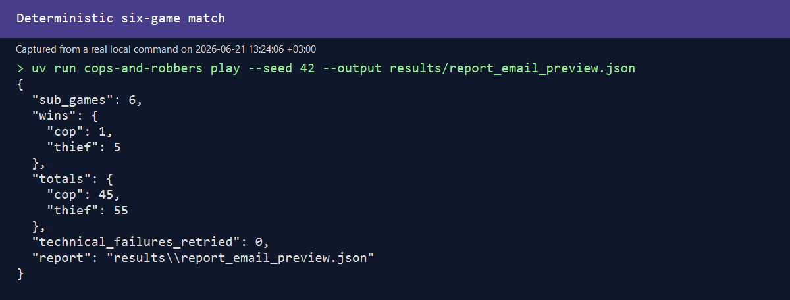
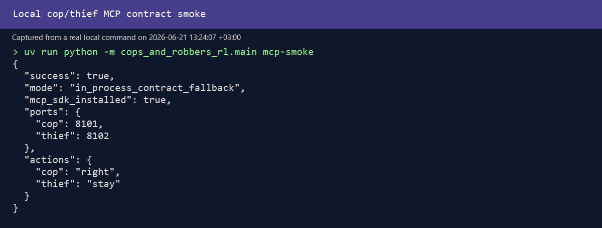

# Teacher Evidence Index

This page maps the submission to likely automated and human assessment checks. Every linked artifact is either generated by a real project command or explicitly labeled as planned/not implemented.

## Demo screenshots

### Native GUI after a complete six-game match

Reproduce on Windows with `powershell -File scripts/capture_gui.ps1`. The script launches the real SDK-backed Tkinter GUI with `gui --demo`, captures its native window, and closes it.

### Headless autonomous match

### Local MCP contract demo

## Assessment map

| Assessment area | Evidence |
|---|---|
| Project planning | [PRD](PRD.md), [architecture/ADRs](PLAN.md), and phased [TODO](TODO.md) |
| Code documentation | [README](../README.md), typed modules, docstrings, and mechanism PRDs |
| Testing and quality | 40 tests, 85.14% coverage, Ruff lint/format, and [GitHub Actions workflow](../.github/workflows/quality.yml) |
| UI and UX | Real native GUI screenshot above; renderer consumes immutable SDK snapshots only |
| Configuration and security | Versioned YAML, strict validation, `.env-example`, ignored `.env`, local-only defaults, auth rejection tests, and automated secret scanning |
| Research and analysis | [Summary report](SUMMARY_REPORT.md), real [learning plots](../results/plots/learning_curve_cop.svg), [loss plot](../results/plots/loss_curve.svg), baseline comparison, limitations, and non-stationarity discussion |
| Version management and AI workflow | Meaningful milestone commits and chronological [prompt/decision log](PROMPT_LOG.md) |
| Cost awareness | Explicit [cost and resource model](COST_AND_RESOURCES.md) with scaling drivers and budget controls |
| Extensibility | SDK boundary, agent interface, local-observation contract, MCP gatekeeper, and [QMIX extension contract](QMIX_EXTENSION.md) |
| Quality standards | CI runs locked setup, coverage, tests, Ruff, formatting, and history-wide credential scanning on every push and PR |

## Honest scope boundary

Implemented evidence covers the deterministic game, six-game runner, baseline agents, tabular IQL pipeline, GUI, dry-run report preview, and local MCP contracts/services. Robust held-out multi-seed conclusions, VDN/QMIX, cloud deployment, and live Gmail delivery are not claimed.
